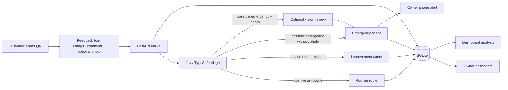

# Chai House Feedback Studio

A local-first customer feedback prototype for **Chai House, Bommanahalli, Bengaluru**. Customers submit quick visit ratings, a written comment, and an optional photo. The owner sees every report in a clean dashboard; only plausible immediate safety reports produce a phone alert.

> **Prototype status:** the complete local demo works without cloud credentials. Jev/Ollama, Google Forms ingestion, and Twilio SMS are configurable integrations. Without model credentials/connectivity, the workflow uses deterministic routing and records urgent alerts in the dashboard/outbox instead of sending a real SMS.

## What it includes

- Mobile-friendly feedback form with food, waiting time, ambience, and staff ratings, optional comment, and optional image.
- Generated QR code for the local form or an external Google Form (`static/qr-feedback.png`).
- FastAPI intake API and an authenticated Apps Script webhook endpoint.
- LangGraph feedback workflow with three bounded routes: emergency, improvement, and routine.
- Ollama Jev/TypeSafe decision adapter for structured urgency routing.
- Optional Ollama vision review for an attached emergency photo.
- SQLite feedback and notification-outbox persistence, with realistic demo records.
- Owner dashboard with emergency, improvement, and analysis views.
- Optional Twilio SMS adapter for immediate owner alerts.
- Architecture PDF describing LangGraph building blocks, Jev routing, agent roles, and guardrails.

## Workflow



## Architecture

| Layer | Prototype technology | Purpose |
|---|---|---|
| Customer experience | Google Forms or built-in FastAPI form | Gather four ratings, optional comment, and optional image |
| Form event | Google Apps Script installable submit trigger | Forward Google Form responses to the backend |
| Intake and UI | FastAPI, Jinja, CSS | Validate responses, serve the dashboard/form, expose APIs |
| Agent orchestration | LangGraph `StateGraph` | Share typed workflow state and route to bounded nodes |
| Fast decision | Ollama Jev / TypeSafe endpoint | Produce an urgency choice for the next graph edge |
| Image review | Ollama vision model, optional | Check whether an uploaded photo appears relevant |
| Storage | SQLite | Store feedback, results, and notification outbox entries |
| Owner alert | Twilio SMS adapter, optional | Notify the owner for possible immediate safety risks |
| Analytics | SQL aggregates + optional Ollama chat model | Calculate metrics in code and write a bounded narrative |

LangGraph is used as explicit workflow orchestration rather than an open-ended agent loop:

```text
START → Jev triage
      → possible emergency + photo → image review → emergency agent ┐
      → possible emergency, no photo ───────────→ emergency agent  │
      → service/quality concern ────────────────→ improvement agent├→ persist → END
      → positive/routine ───────────────────────→ routine route    ┘
```

Dashboard analysis is a separate LangGraph `StateGraph` with a bounded analyst node. SQLite calculates counts, rating averages, and category totals first. The narrative model receives those metrics and must not invent figures or patterns.

## Why Jev is useful here

Jev/TypeSafe is the prototype’s fast decision layer. It can answer typed urgency and category questions using the submitted ratings and comment, allowing the graph to route a report without asking a general-purpose model to decide every step. The local Ollama Jev-style endpoint requires Ollama 0.35 or newer and a decision model such as `nimble`; older versions fall back to the deterministic classifier. Jev does not replace the workflow, image model, notification provider, or SQL analytics.

The application validates Jev’s output and applies a hard safety override for explicit hazard reports. If Jev is unavailable or returns an invalid label, the deterministic fallback keeps intake working. Configure the Jev-style Ollama endpoint with `OLLAMA_BASE_URL` and `OLLAMA_DECISION_MODEL`.

## Safety guardrails

1. **A photo never gates an emergency alert.** A plausible immediate safety report triggers the emergency route even when no image is attached or vision review fails.
2. **A photo alone does not create an emergency.** The image is reviewed only in the context of a customer report.
3. **Reports remain unverified.** Owner messages say “a customer reported a possible…” and do not claim the event is confirmed.
4. **Jev cannot downgrade an explicit hazard report.** The application applies a deterministic override before routing.
5. **Every route is visible.** Emergency, improvement, and routine feedback are all stored and shown on the dashboard.
6. **No SMS for ordinary dissatisfaction.** Taste, service, ambience, and waiting-time issues appear in the improvement queue.
7. **No invented dashboard metrics.** Code calculates totals and averages; the analysis model only summarizes supplied values.
8. **Fallback instead of dropped feedback.** Workflow errors are stored with `needs_review` status for the owner.
9. **Duplicate-alert protection.** One notification outbox row is allowed per feedback ID.
10. **Minimal customer data.** The form does not request a name, phone number, or email address.

## Run locally

### Prerequisites

- Windows PowerShell or another shell
- Python 3.11 (the supplied script uses `uv` to create/manage the environment)
- Optional: [Ollama](https://ollama.com/) for Jev and chat/vision model calls

From this repository:

```powershell
Copy-Item .env.example .env
powershell.exe -NoProfile -ExecutionPolicy Bypass -File .\scripts\run_local.ps1
```

The command uses a process-scoped execution-policy bypass; it does not change the machine’s PowerShell policy.

The script starts Uvicorn on `0.0.0.0:8000`. It tries to put the computer’s LAN address in the generated feedback QR, so a phone on the same Wi-Fi can scan it. If no LAN address is detected, the QR defaults to `127.0.0.1` and works on the computer running the server. For phone scanning, set `APP_PUBLIC_URL` in `.env` to the computer’s reachable address, for example `http://192.168.1.20:8000`.

Open:

- Owner dashboard: `http://127.0.0.1:8000/`
- Customer feedback form: `http://127.0.0.1:8000/feedback`
- Generated QR image: `http://127.0.0.1:8000/static/qr-feedback.png`
- Health check: `http://127.0.0.1:8000/health`
- Dashboard JSON: `http://127.0.0.1:8000/api/dashboard`
- API docs: `http://127.0.0.1:8000/docs`

On a phone connected to the same Wi-Fi, open the LAN URL printed/set in `APP_PUBLIC_URL`; `localhost` on the phone refers to the phone, not the computer.

### Optional Ollama setup

Run Ollama locally and pull model names suitable for your machine. The default Jev model is `nimble`; the vision and chat model names can be changed in `.env`. Set:

```env
OLLAMA_BASE_URL=http://127.0.0.1:11434
OLLAMA_DECISION_MODEL=nimble
OLLAMA_CHAT_MODEL=llama3.2:latest
OLLAMA_VISION_MODEL=qwen2.5vl:7b
```

If models are not available, the prototype still accepts feedback using deterministic triage. A vision review failure leaves the image status inconclusive and never blocks an emergency alert.

### Optional owner SMS

Configure Twilio credentials and the owner number in `.env`:

```env
TWILIO_ACCOUNT_SID=
TWILIO_AUTH_TOKEN=
TWILIO_FROM_NUMBER=
OWNER_PHONE_NUMBER=
```

Without all four values, urgent alerts are logged as `demo_logged` and appear on the dashboard. Do not commit `.env` or credentials.

### Optional Google Forms integration

Set `WEBHOOK_TOKEN` to a long random value and optionally set `GOOGLE_FORM_URL`. The QR then opens the Google Form URL, and the built-in form remains available at `/feedback?demo=true`. The webhook returns `503` while no token is configured and rejects requests with an invalid token.

Create an Apps Script project bound to the response Sheet and add an installable **On form submit** trigger. Adapt the question labels below to exactly match your Form:

```javascript
const BACKEND_URL = "https://YOUR-HTTPS-HOST/webhooks/google-form";
const WEBHOOK_TOKEN = "same-secret-as-WEBHOOK_TOKEN";

function onFormSubmit(e) {
  const payload = { namedValues: e.namedValues };
  const response = UrlFetchApp.fetch(BACKEND_URL, {
    method: "post",
    contentType: "application/json",
    headers: { "X-Webhook-Token": WEBHOOK_TOKEN },
    payload: JSON.stringify(payload),
    muteHttpExceptions: true
  });
  console.log(response.getResponseCode(), response.getContentText());
}
```

The Google Form submit trigger must call an HTTPS endpoint reachable from Google. A local `localhost` URL cannot be reached by Apps Script; use a temporary HTTPS tunnel for a demo or deploy the API. Google file-upload questions require customers to sign in to a Google Account. The prototype’s built-in form supports optional images directly. Google Drive file links are stored as references only and are not automatically downloaded or analyzed.

## API endpoints

| Method | Path | Purpose |
|---|---|---|
| `GET` | `/` | Owner dashboard |
| `GET` | `/feedback` | Customer form or redirect to configured Google Form |
| `POST` | `/feedback` | Customer form submission with optional image |
| `POST` | `/api/feedback` | JSON feedback submission |
| `POST` | `/webhooks/google-form` | Token-protected Apps Script webhook |
| `GET` | `/api/dashboard` | Dashboard metrics and analysis JSON |
| `GET` | `/api/feedback/{id}` | One feedback record without local image path |
| `GET` | `/api/qr` | QR target URL and image path |
| `GET` | `/health` | App and database health |

## Owner dashboard

The UI uses a white and black visual system with muted gray surfaces and red emergency indicators. It provides:

- Total response and category-rating cards
- An emergency banner and emergency-only filter
- A separate needs-improvement queue
- The latest customer comments and optional-photo indicator
- A concise feedback-analysis narrative and top category signals
- The QR code and a link to preview the customer form

## PDF architecture guide

The implementation guide is at [`docs/chai-house-feedback-architecture.pdf`](docs/chai-house-feedback-architecture.pdf). To regenerate it after editing the source:

```powershell
uv run --python 3.11 python scripts/build_architecture_pdf.py
```

The source is [`scripts/build_architecture_pdf.py`](scripts/build_architecture_pdf.py).

## Data and deployment notes

- SQLite database: `data/chaihouse-feedback.db` (ignored by Git).
- Uploaded images: `data/uploads/` (ignored by Git, 5 MB limit, JPG/PNG/WebP only).
- Demo data is seeded once at startup; remove the local DB to reset the demo.
- The dashboard is a prototype and is not yet protected by owner authentication. Keep it on a trusted local network; add authentication and HTTPS before public deployment.
- Real Google Forms, Jev, vision, and phone behavior depends on external account/model configuration.
- SMS delivery is not guaranteed by this prototype; confirm provider status before treating it as an operational safety channel.

## Project structure

```text
app/
  agents/workflow.py       LangGraph routing and three feedback agents
  services/llm.py          Jev, vision, and analytics adapters for Ollama
  services/notifications.py Optional Twilio SMS adapter
  config.py                Environment settings
  db.py                    SQLite schema, queries, and demo records
  main.py                  FastAPI intake, web pages, APIs, webhook, QR
  static/styles.css        Responsive monochrome UI
  templates/               Dashboard, customer form, thank-you page
docs/                      Architecture and guardrails PDF
scripts/                   Local runner and PDF source
```
